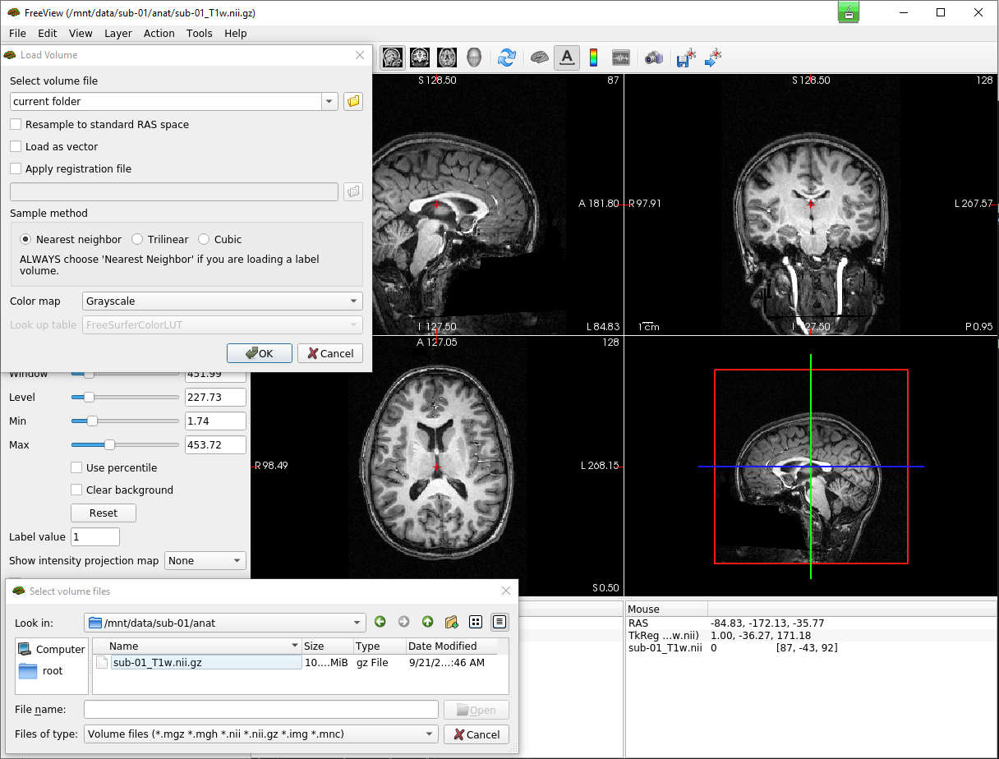

Docker Info
====

For group member who is new to Docker, there is nice tutorial_ and videos_ to learn Docker. 
Why are we using Docker? We had so many issues with the old server due to the dependencies. For instance, using ``fmriprep`` requires 8 other software, each of them needs some other packages. At the end of the day, the software may still not work because of compatibility or other unknown conflicts. While Docker runs software in an isolated container(environment) without bothering the OS configuration.

Most neuroimaging software offered their official Docker image which can be directly used for your analysis. Once you have been added to the Docker group (if you are not, please call 7849), you can use Docker commands.

.. _tutorial: https://docker-curriculum.com/
.. _videos: https://www.youtube.com/watch?v=fqMOX6JJhGo

*Display all loaded images in the system:*

::

   docker images

::

   REPOSITORY              TAG             IMAGE ID       CREATED         SIZE
   freesurfer/freesurfer   freeviewAvail   09e4aa459595   24 hours ago    15.4GB
   centos                  centos7         eeb6ee3f44bd   13 days ago     204MB
   centos                  centos8         5d0da3dc9764   13 days ago     231MB
   nipreps/fmriprep        latest          fcfc5f9bfd20   3 weeks ago     24.9GB
   freesurfer/freesurfer   7.2.0           8e15973a3dcd   3 weeks ago     12.5GB
   hello-world             latest          d1165f221234   6 months ago    13.3kB
   poldracklab/mriqc       0.16.1          77dee0ba9d5a   8 months ago    8.38GB
   poetair/fsl6.0.3_x11    latest          9a71492f908e   10 months ago   14.4GB

There are several popular software installed already, for an example of using ``mriqc`` which is a tool to perform quality assessments for imaging data, please check the `notes <https://sarenseeley.github.io/BIDS-fmriprep-MRIQC.html#mriqc>`_

Here, I introduce a brief example of using a GUI app such as ``freeview`` with Docker.

Firstly, we lunch freesurfer from Docker by: 

::

   docker run --name kenTest -it -v /home/ken/fmriExample/fmriData/:/mnt/data 09e4aa459595 bash
   
where ``-it`` instructs Docker to allocate a pseudo-TTY connected to the container’s stdin; creating an interactive bash shell in the container. ``-v`` bind a volume which in this case is the dataset we wanted to use from the server path: ``/home/ken/fmriExample/fmriData/`` with freesurfer and mount it at path : ``/mnt/data`` in the container.  ``09e4aa459595`` is the Image ID. 

.. warning::

   Importantly, please specify the ``--name`` involves your user name, otherwise, Docker will assign a name randomly, these random names would be seen as a redundant process and cleaned during the maintenance. In addition, ``-it``mostly used in debugging sessions, you may use ``-rm`` when running real analysis.

One the previous step executed, you will see the command header becomes: 

::

   [root@<container ID>]#
   
Because freesurfer requires a license, you need to download a free license in order to use the software via link_. Then, copy the license file to the relevant path in the freesurfer software: 

::

   cp /mnt/data/derivatives/license.txt /usr/local/freesurfer/.license
   
Further, we set up the display variable $DISPLAY with your own computer IP:

::

   export DISPLAY=10.136.26.238:0.0

where you have to replace ``10.136.26.238``with your own IP address. The last step is just open freeview:

::

   freeview

.. _link: https://surfer.nmr.mgh.harvard.edu/fswiki/License
   
   
